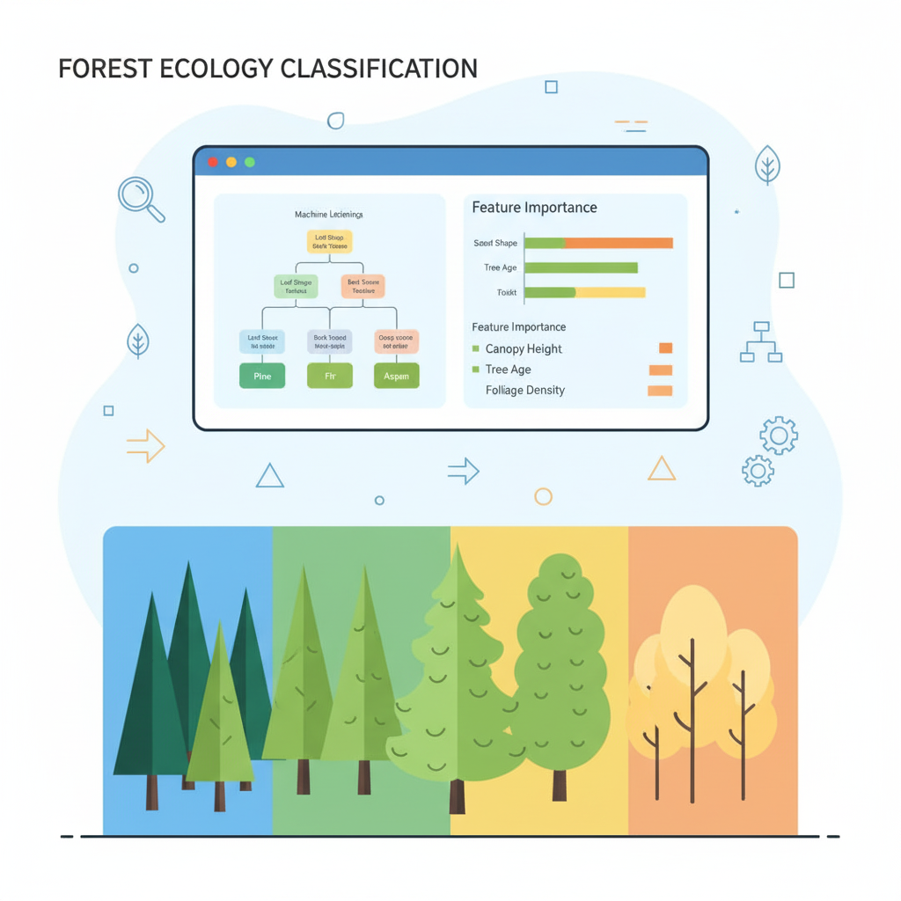

  

# 🌲 **FOREST COVER TYPE CLASSIFICATION**

## 🧾 **PROJECT DESCRIPTION**
*Classify forest cover types based on cartographic variables using Machine Learning.* 🌍  

This project uses supervised learning models such as **Random Forest Classifier** and **Decision Trees** to predict the type of forest cover from geographical and ecological data.  

---

## 📚 **TABLE OF CONTENTS**
- 📌 **Project Title**
- 🧾 **Project Description**
- 📚 **Table of Contents**
- 📊 **Dataset Information**
- 🛠️ **Tech Stack Used**
- 🧠 **Workflow & Methodology**
- 📈 **Model Performance**
- 🧪 **How to Use**
- 🏁 **Results**
- 👥 **Author**

---

## 📊 **DATASET INFORMATION**
- **Name**: *Forest Cover Type Dataset* (UCI / Kaggle)  
- **Format**: CSV  
- **Total Entries**: ~581,000 rows  
- **Columns**:
  - `Elevation`, `Aspect`, `Slope`  
  - `Horizontal_Distance_To_Hydrology`, `Vertical_Distance_To_Hydrology`  
  - `Horizontal_Distance_To_Roadways`, `Hillshade_9am/Noon/3pm`  
  - `Soil_Type` (categorical)  
  - `Wilderness_Area` (categorical)  
  - `Cover_Type` (Target Variable: 7 forest types 🌲🌳)  

---

## 🛠️ **TECH STACK USED**
- **Programming Language**: 🐍 *Python 3*  
- **Libraries & Tools**:
  - `pandas`, `numpy`  
  - `matplotlib`, `seaborn`  
  - `scikit-learn` (DecisionTree, RandomForest, train_test_split, accuracy_score)  

---

## 🧠 **WORKFLOW & METHODOLOGY**
1. **Load and Inspect Data**  
2. **Data Preprocessing** 🧹  
   - Handle missing values  
   - Encode categorical features  
   - Scale numerical features if needed  
3. **Exploratory Data Analysis (EDA)** 📊  
   - Visualize distributions of features  
   - Correlation heatmaps  
4. **Model Training** 🤖  
   - Decision Tree Classifier 🌳  
   - Random Forest Classifier 🌲  
5. **Model Evaluation** 📈  
   - Accuracy Score  
   - Confusion Matrix  
   - Feature Importance Analysis  

---

## 📈 **MODEL PERFORMANCE**
| Model                  | Accuracy |
|-------------------------|----------|
| Random Forest           | ~80%     |
| XGBoost                 | ~81%     |

---

## 🧪 **HOW TO USE**
- Open the notebook: `Forest_Cover_Type_Classification.ipynb`  
- Run the cells in order  
- Observe preprocessing, training, and prediction steps  
- Try predicting **cover type** for new samples by modifying input  

---

## 🏁 **RESULTS**
- ✔️ Successfully classified **forest cover types** using cartographic data  
- ✔️ Model generalizes well to unseen data  

---

## 👥 **AUTHOR**
- **Arghya Chakraborty**  

---

💡 *Made with ❤️ using Python, Pandas, Matplotlib, Seaborn & Scikit-learn*
